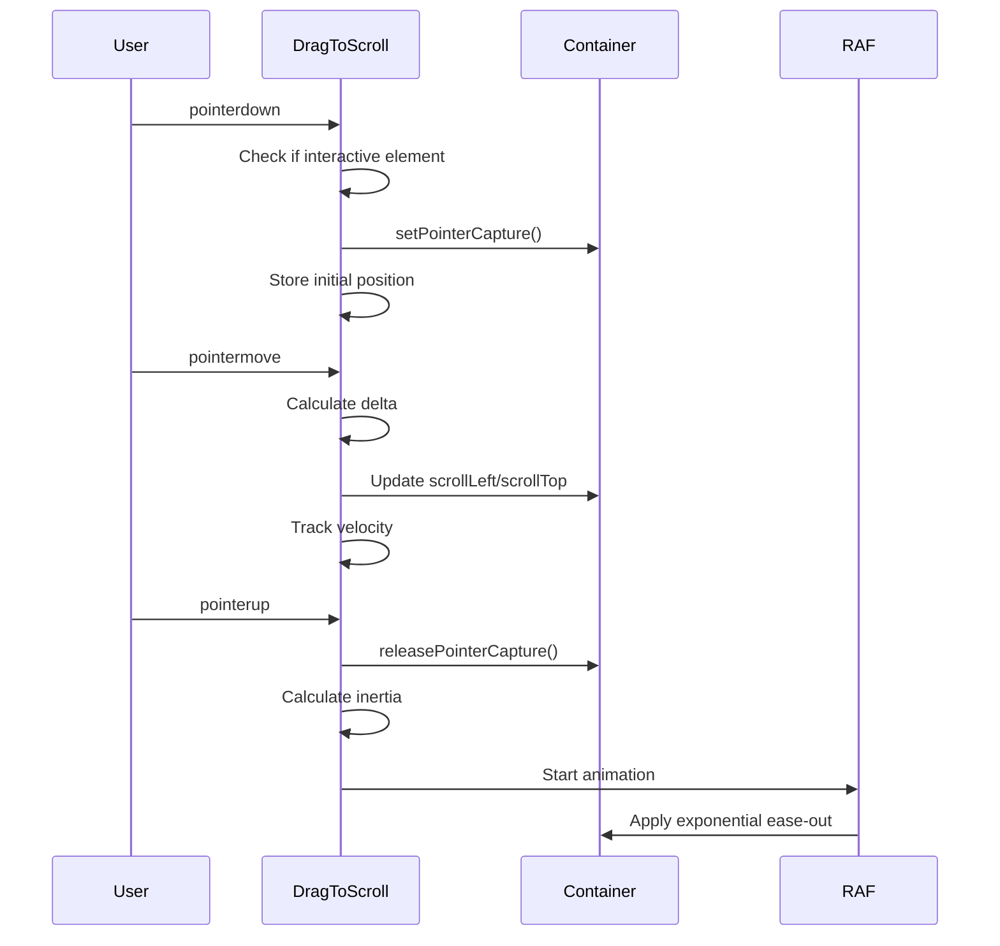

# DragToScrollOnPc

Enable drag-to-scroll behavior on desktop browsers, mimicking the natural touch scrolling experience found on mobile devices. Click and drag to scroll through any container element.

---

## ✨ Features

- 🖱️ **Desktop-First** — Automatically disabled on touch/coarse-pointer devices
- 🎯 **Axis Control** — Scroll horizontally, vertically, or both
- 🚀 **Inertial Scrolling** — Smooth momentum-based deceleration after release
- 🎨 **Smart Cursors** — Auto-switches between `grab` and `grabbing` cursors
- 🎯 **Interactive Elements** — Automatically ignores links, buttons, and form inputs
- ⚡ **Performance** — Uses RAF-based animations and pointer capture
- 🔒 **Click Prevention** — Optionally prevents accidental clicks after dragging
- 👁️ **Hidden Scrollbars** — Automatically hides scrollbars while active (restored on destroy)
- 🌐 **Shadow DOM Support** — Works seamlessly with Shadow DOM and light DOM
- 🪶 **Lightweight** — Zero dependencies, vanilla JavaScript

---

## 🚀 Quick Start

```javascript
import DragToScrollOnPc from './DragToScrollOnPc/index.js'

// Basic usage
const container = document.querySelector('.scrollable-container')
const dragger = new DragToScrollOnPc(container)

// With options
const dragger = new DragToScrollOnPc(container, {
    axis: 'x',              // Only horizontal scrolling
    useInertia: true,       // Enable momentum scrolling
    dragThresholdPx: 5      // Minimum distance before dragging starts
})

// Cleanup when done
dragger.destroy()
```

---

## 📖 How It Works

### Interaction Flow



### Inertia System

The module uses velocity tracking and exponential decay for natural-feeling momentum:

1. **Velocity Tracking** — Continuously measures pointer movement speed (px/ms)
2. **Recent Window** — Only considers movement from the last 300ms to avoid stale gestures
3. **Idle Detection** — Skips inertia if pointer was idle >150ms before release
4. **Exponential Decay** — Uses `e^(-friction * t)` for smooth deceleration
5. **Boundary Clamping** — Respects scroll limits during animation

---

## 📚 API Reference

### Constructor

```javascript
new DragToScrollOnPc(element, options)
```

| Parameter | Type | Description |
|-----------|------|-------------|
| `element` | `HTMLElement` | The scrollable container element |
| `options` | `DragToScrollOptions` | Optional configuration object |

**Throws:** `Error` if element is not a valid HTMLElement

---

### Options

| Option | Type | Default | Description |
|--------|------|---------|-------------|
| `axis` | `'x' \| 'y' \| 'both'` | `'both'` | Limit dragging to one axis or both |
| `desktopOnly` | `boolean` | `true` | Disable on touch/coarse-pointer devices |
| `cancelClickOnDrag` | `boolean` | `true` | Prevent clicks after a drag gesture |
| `dragThresholdPx` | `number` | `3` | Distance (px) before considering it a drag |
| `useInertia` | `boolean` | `true` | Enable inertial scrolling on release |
| `inertiaDurationMs` | `number` | `600` | Duration of inertia animation in ms |
| `inertiaMultiplier` | `number` | `600` | Velocity → distance multiplier (px = px/ms × multiplier) |
| `minInertiaAmplitudePx` | `number` | `5` | Minimum travel (px) to start inertia |
| `easingFriction` | `number` | `6` | Exponential friction coefficient (higher = stops sooner) |
| `inertiaIdleTimeoutMs` | `number` | `150` | If idle ≥ this time (ms) before release, skip inertia |
| `recentWindowMs` | `number` | `300` | Lookback window (ms) to measure recent displacement |
| `minRecentTravelPx` | `number` | `10` | Minimum net travel (px) within lookback window |
| `setCursors` | `boolean` | `true` | Toggle grab/grabbing cursors while dragging |
| `preventTextSelection` | `boolean` | `true` | Disable user selection while dragging |
| `cursorGrab` | `string` | `'grab'` | CSS cursor when idle |
| `cursorGrabbing` | `string` | `'grabbing'` | CSS cursor while dragging |
| `touchAction` | `string` | `'pan-x pan-y'` | Applied to element for Pointer Events |
| `interactiveSelector` | `string` | `'a,button,input,textarea,select,[contenteditable],[draggable="true"]'` | Elements that shouldn't initiate drag |
| `hideScrollbars` | `boolean` | `true` | Hide scrollbars while active, restore on destroy |

---

### Methods

#### `destroy()`

Removes all event listeners and restores original styles.

```javascript
const dragger = new DragToScrollOnPc(element)

// Later, when component is removed or no longer needed
dragger.destroy()
```

**Important:** Always call `destroy()` when removing the element or component to:
- Remove event listeners (prevent memory leaks)
- Restore original cursor, user-select, and touch-action styles
- Restore original scrollbar visibility
- Cancel any ongoing inertia animations

---

## 🎯 Common Use Cases

### Horizontal Image Gallery

```javascript
const gallery = document.querySelector('.image-gallery')
const dragger = new DragToScrollOnPc(gallery, {
    axis: 'x',
    useInertia: true,
    hideScrollbars: true
})
```

```css
.image-gallery {
    display: flex;
    gap: 1rem;
    overflow-x: auto;
    overflow-y: hidden;
}

.image-gallery img {
    height: 300px;
    object-fit: cover;
    flex-shrink: 0;
}
```

---

### Timeline or Gantt Chart

```javascript
const timeline = document.querySelector('.timeline-container')
const dragger = new DragToScrollOnPc(timeline, {
    axis: 'both',
    dragThresholdPx: 5,
    inertiaDurationMs: 800,
    easingFriction: 5  // Longer deceleration for large data
})
```

---

### Card Carousel

```javascript
const carousel = document.querySelector('.card-carousel')
const dragger = new DragToScrollOnPc(carousel, {
    axis: 'x',
    cancelClickOnDrag: true,  // Prevent card clicks while dragging
    useInertia: true,
    minRecentTravelPx: 20     // Require more intentional swipes
})
```

---

### Table with Frozen Headers

```javascript
const tableBody = document.querySelector('.table-body-scroll')
const dragger = new DragToScrollOnPc(tableBody, {
    axis: 'both',
    preventTextSelection: true,
    hideScrollbars: false,  // Keep scrollbars visible for orientation
    interactiveSelector: 'a,button,input,textarea,select,.sortable-header'
})
```

---

## 🧩 Real-World Example: Component Integration

### React Component

```javascript
import { useEffect, useRef } from 'react'
import DragToScrollOnPc from './DragToScrollOnPc/index.js'

function ScrollableGallery({ images }) {
    const containerRef = useRef(null)
    const draggerRef = useRef(null)

    useEffect(() => {
        if (containerRef.current) {
            draggerRef.current = new DragToScrollOnPc(containerRef.current, {
                axis: 'x',
                useInertia: true
            })
        }

        return () => {
            draggerRef.current?.destroy()
        }
    }, [])

    return (
        <div ref={containerRef} className="gallery">
            {images.map((img, i) => (
                
            ))}
        </div>
    )
}
```

---

### Vanilla JS with Dynamic Content

```javascript
class ImageGallery {
    constructor(containerId) {
        this.container = document.getElementById(containerId)
        this.dragger = null
        this.init()
    }

    init() {
        this.dragger = new DragToScrollOnPc(this.container, {
            axis: 'x',
            useInertia: true,
            cancelClickOnDrag: true
        })

        // Load images dynamically
        this.loadImages().then(() => {
            console.log('Gallery ready with drag-to-scroll')
        })
    }

    async loadImages() {
        const response = await fetch('/api/gallery-images')
        const images = await response.json()

        images.forEach(img => {
            const imgEl = document.createElement('img')
            imgEl.src = img.url
            imgEl.alt = img.alt
            imgEl.addEventListener('click', () => this.openLightbox(img))
            this.container.appendChild(imgEl)
        })
    }

    openLightbox(img) {
        // Only opens if click wasn't part of a drag
        console.log('Opening:', img.url)
    }

    destroy() {
        this.dragger?.destroy()
        this.container.innerHTML = ''
    }
}

// Usage
const gallery = new ImageGallery('my-gallery')

// Cleanup
// gallery.destroy()
```

---

### Web Component

```javascript
import DragToScrollOnPc from './DragToScrollOnPc/index.js'

class DraggableCarousel extends HTMLElement {
    constructor() {
        super()
        this.attachShadow({ mode: 'open' })
        this.dragger = null
    }

    connectedCallback() {
        this.shadowRoot.innerHTML = `
            <style>
                :host {
                    display: block;
                    width: 100%;
                }
                .carousel {
                    display: flex;
                    gap: 1rem;
                    overflow-x: auto;
                    overflow-y: hidden;
                    padding: 1rem 0;
                }
                ::slotted(*) {
                    flex-shrink: 0;
                }
            </style>
            <div class="carousel">
                <slot></slot>
            </div>
        `

        const carousel = this.shadowRoot.querySelector('.carousel')
        this.dragger = new DragToScrollOnPc(carousel, {
            axis: 'x',
            useInertia: true
        })
    }

    disconnectedCallback() {
        this.dragger?.destroy()
    }
}

customElements.define('draggable-carousel', DraggableCarousel)
```

```html
<!-- Usage -->
<draggable-carousel>
    
    
    
</draggable-carousel>
```

---

## 💡 Tips & Best Practices

### ✅ Do

```javascript
// Always destroy when removing elements
const dragger = new DragToScrollOnPc(element)
element.remove()
dragger.destroy()  // ✅ Prevents memory leaks

// Use axis constraints for better UX
new DragToScrollOnPc(horizontalScroller, { axis: 'x' })  // ✅ Natural horizontal scrolling

// Adjust thresholds for your content
new DragToScrollOnPc(element, {
    dragThresholdPx: 8,      // ✅ Larger for fat-finger friendliness
    minRecentTravelPx: 15    // ✅ Require more intentional gestures
})

// Customize for your design
new DragToScrollOnPc(element, {
    cursorGrab: 'url(hand-open.png), grab',
    cursorGrabbing: 'url(hand-closed.png), grabbing'
})

// Fine-tune inertia for content type
new DragToScrollOnPc(largeDataset, {
    inertiaDurationMs: 1000,  // ✅ Longer for big datasets
    easingFriction: 4         // ✅ Lower = longer coast
})
```

### ❌ Avoid

```javascript
// Don't create multiple instances on the same element
const dragger1 = new DragToScrollOnPc(element)
const dragger2 = new DragToScrollOnPc(element)  // ❌ Conflicts

// Don't forget to destroy
new DragToScrollOnPc(element)  // ❌ Memory leak when element is removed

// Don't use on non-scrollable elements
const dragger = new DragToScrollOnPc(staticDiv)  // ❌ No overflow, nothing to scroll

// Don't disable desktopOnly unless necessary
new DragToScrollOnPc(element, {
    desktopOnly: false  // ❌ May conflict with native touch scrolling
})

// Don't set dragThreshold too high
new DragToScrollOnPc(element, {
    dragThresholdPx: 50  // ❌ Makes dragging feel unresponsive
})
```

---

## 🎨 Styling Considerations

### CSS Requirements

```css
/* Element must have overflow and defined dimensions */
.scrollable {
    overflow: auto;
    width: 100%;
    height: 400px;
}

/* Or use flex/grid with overflow */
.flex-container {
    display: flex;
    overflow-x: auto;
    overflow-y: hidden;
}
```

### Custom Cursors

```javascript
new DragToScrollOnPc(element, {
    cursorGrab: 'url(custom-open.cur), grab',
    cursorGrabbing: 'url(custom-closed.cur), grabbing'
})
```

### Scrollbar Styling (if not hidden)

```css
.scrollable {
    scrollbar-width: thin;
    scrollbar-color: #888 #f1f1f1;
}

.scrollable::-webkit-scrollbar {
    height: 8px;
}

.scrollable::-webkit-scrollbar-thumb {
    background: #888;
    border-radius: 4px;
}
```

---

## ⚙️ Advanced Configuration

### Fine-Tuning Inertia

```javascript
// For smooth, long-distance coasting
new DragToScrollOnPc(element, {
    inertiaDurationMs: 1200,      // Longer animation
    inertiaMultiplier: 800,       // Greater distance per velocity unit
    easingFriction: 4,            // Slower deceleration
    minInertiaAmplitudePx: 3      // More sensitive trigger
})

// For precise, controlled scrolling
new DragToScrollOnPc(element, {
    inertiaDurationMs: 400,       // Shorter animation
    inertiaMultiplier: 400,       // Less distance per velocity unit
    easingFriction: 8,            // Faster deceleration
    minInertiaAmplitudePx: 10     // Less sensitive trigger
})
```

### Velocity Tracking Tuning

```javascript
// For more responsive inertia
new DragToScrollOnPc(element, {
    recentWindowMs: 200,          // Shorter memory of recent motion
    minRecentTravelPx: 5,         // Lower threshold for activation
    inertiaIdleTimeoutMs: 100     // Less idle tolerance
})

// For more deliberate inertia
new DragToScrollOnPc(element, {
    recentWindowMs: 400,          // Longer memory of recent motion
    minRecentTravelPx: 20,        // Higher threshold for activation
    inertiaIdleTimeoutMs: 200     // More idle tolerance
})
```

---

## 🔍 Technical Details

### Pointer Events

The module uses the modern Pointer Events API:
- Works with mouse, pen, and touch input uniformly
- Uses `setPointerCapture()` for reliable tracking even outside element bounds
- Respects `touch-action` CSS property to avoid conflicts with native gestures

### Velocity Calculation

Velocity is estimated using exponential smoothing:

```
velocityX = 0.8 × oldVelocityX + 0.2 × instantaneousVelocityX
```

This provides stable velocity estimates that respond to user input while filtering out noise.

### Scrollbar Hiding

Scrollbars are hidden using three techniques:
- **Firefox**: `scrollbar-width: none`
- **IE/Legacy Edge**: `-ms-overflow-style: none`
- **WebKit (Chrome/Safari)**: `::-webkit-scrollbar { display: none }`

Styles are injected into the appropriate root (Document or ShadowRoot) and cleaned up on `destroy()`.

---

## 🐛 Troubleshooting

### Drag not working

**Check:** Element must have `overflow` set and scrollable content:

```css
.container {
    overflow: auto;  /* or overflow-x/overflow-y */
    width: 100%;
    height: 400px;
}
```

### Click events firing after drag

**Solution:** Ensure `cancelClickOnDrag` is enabled (default):

```javascript
new DragToScrollOnPc(element, {
    cancelClickOnDrag: true  // Default, but explicit is clear
})
```

### Interactive elements not clickable

**Check:** Your custom selector might be too broad:

```javascript
new DragToScrollOnPc(element, {
    interactiveSelector: 'a,button,.clickable'  // Only what you need
})
```

### Inertia feels wrong

**Solution:** Adjust the friction and duration:

```javascript
new DragToScrollOnPc(element, {
    inertiaDurationMs: 800,    // Try different values
    easingFriction: 5          // Lower = longer coast
})
```

### Conflicts with native touch scrolling

**Solution:** Keep `desktopOnly: true` (default) or adjust `touch-action`:

```javascript
new DragToScrollOnPc(element, {
    desktopOnly: true,           // Recommended
    touchAction: 'pan-x pan-y'   // Or specific axis
})
```