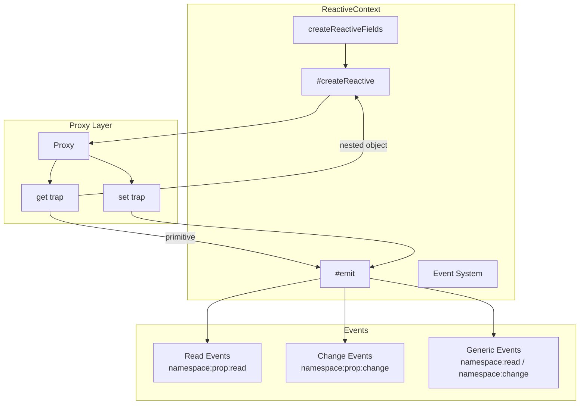
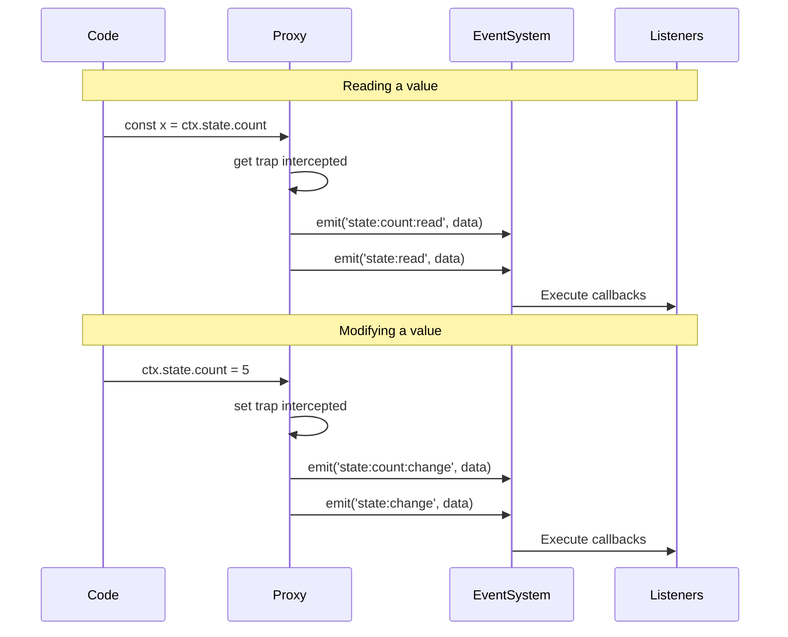

# ReactiveContext

A lightweight, zero-dependency reactive state management system for JavaScript. Built on ES6 Proxies with a powerful event-driven architecture.

---

## ✨ Features

- 🎯 **Deep Reactivity** — Automatically tracks changes at any nesting level
- 👁️ **Read Tracking** — Emits events when values are accessed
- 📡 **Event-Driven** — Pub/Sub pattern with specific and generic events
- 🔄 **Array Support** — Intercepts all mutating array methods
- 🪶 **Lightweight** — ~200 lines, zero dependencies
- 🛡️ **Safe** — Warns when reassigning objects (which removes reactivity)
- 🧩 **Extensible** — Designed to be extended for domain-specific contexts

---

## 🚀 Quick Start

```javascript
import { ReactiveContext } from './ReactiveContext/index.js'

class AppContext extends ReactiveContext {
    constructor() {
        super()
        this.createReactiveFields({
            state: { count: 0, loading: false },
            items: []
        })
    }
}

const ctx = new AppContext()

// Listen to reads
ctx.on('state:count:read', (data) => {
    console.log(`Count was read: ${data.value}`)
})

// Listen to changes
ctx.on('state:count:change', (data) => {
    console.log(`Count: ${data.old_value} → ${data.new_value}`)
})

// Trigger read reactivity
const x = ctx.state.count  // Logs: "Count was read: 0"

// Trigger change reactivity
ctx.state.count = 5  // Logs: "Count: 0 → 5"
```

---

## 🏗️ Architecture



---

## 📖 How It Works

### Event Flow

When you read or modify a reactive property, the system emits events:



### Nested Reactivity

Objects are wrapped in Proxies recursively when accessed:

```javascript
ctx.state.user.profile.name = 'Ana'
//  │      │     │       │
//  │      │     │       └─ SET intercepted → emits change events
//  │      │     └─ GET returns Proxy of 'profile'
//  │      └─ GET returns Proxy of 'user'
//  └─ GET returns Proxy of 'state'
```

---

## 📚 API Reference

### `createReactiveFields(definitions)`

Creates reactive fields on the instance.

| Parameter | Type | Description |
|-----------|------|-------------|
| `definitions` | `Object` | Key-value pairs of field names and initial values |

```javascript
this.createReactiveFields({
    state: { count: 0 },
    user: { name: '', authenticated: false },
    items: []
})
```

---

### `on(event, callback)`

Registers an event listener.

| Parameter | Type | Description |
|-----------|------|-------------|
| `event` | `string` | Event name pattern |
| `callback` | `Function` | Handler `(data, context) => void` |

**Returns:** `Function` — Cleanup function to unregister the listener

```javascript
// Listen to reads
ctx.on('state:count:read', (data, context) => {
    console.log(`Value read: ${data.value}`)
})

// Listen to changes
const cleanup = ctx.on('state:count:change', (data, context) => {
    console.log(data.new_value)
})

// Later: remove listener
cleanup()
```

---

### `off(event, callback)`

Removes a specific event listener.

```javascript
const handler = (data) => console.log(data)
ctx.on('state:change', handler)
ctx.off('state:change', handler)
```

---

### `once(event, callback)`

Registers a one-time listener that auto-removes after execution.

```javascript
ctx.once('state:initialized:change', (data) => {
    console.log('Initialized!')
})
```

---

### `removeAllListeners([event])`

Removes all listeners for an event, or all listeners entirely.

```javascript
ctx.removeAllListeners('state:change')  // Specific event
ctx.removeAllListeners()                 // All events
```

---

### `getRegisteredEvents()`

Returns an array of all event names with registered listeners.

```javascript
console.log(ctx.getRegisteredEvents())
// ['state:count:read', 'state:count:change', 'state:change']
```

---

### `getListenerCount(event)`

Returns the number of listeners for an event.

```javascript
console.log(ctx.getListenerCount('state:change'))  // 2
```

---

### `hasListeners(event)`

Returns `true` if the event has at least one listener.

```javascript
if (ctx.hasListeners('state:change')) {
    console.log('Someone is listening')
}
```

---

## 🎯 Event Naming Convention

Events follow these patterns:

```
namespace:property:read     → Specific read event
namespace:read              → Generic read event
namespace:property:change   → Specific change event
namespace:change            → Generic change event
```

### Examples

| Action | Specific Event | Generic Event |
|--------|---------------|---------------|
| `const x = ctx.state.count` | `state:count:read` | `state:read` |
| `ctx.state.count = 5` | `state:count:change` | `state:change` |
| `const n = ctx.state.user.name` | `state.user:name:read` | `state.user:read` |
| `ctx.state.user.name = 'Ana'` | `state.user:name:change` | `state.user:change` |
| `ctx.items.push('x')` | — | `items:change` |
| `ctx.items[0] = 'y'` | `items:0:change` | `items:change` |

---

## 📦 Event Data Structure

### Read Event

```javascript
{
    prop: 'count',
    value: 5,
    timestamp: 1699999999999
}
```

### Change Event

```javascript
{
    prop: 'count',
    old_value: 0,
    new_value: 5,
    timestamp: 1699999999999
}
```

### Array Mutation Event

```javascript
{
    method: 'push',
    args: ['new item'],
    length: 3,
    timestamp: 1699999999999
}
```

---

## 👁️ Read Reactivity

Read events are emitted when primitive values are accessed. This is useful for:

- **Lazy loading** — Load data when first accessed
- **Debugging** — Track which properties are being used
- **Analytics** — Monitor property access patterns
- **Caching** — Implement computed properties

```javascript
// Track reads for debugging
ctx.on('state:read', (data) => {
    console.log(`[DEBUG] Read ${data.prop}: ${data.value}`)
})

// Lazy loading example
ctx.on('user:profile:read', (data, context) => {
    if (data.value === null) {
        fetchUserProfile().then(profile => {
            context.user.profile = profile
        })
    }
})
```

> **Note:** Read events are only emitted for primitive values. Accessing nested objects does not emit read events (only the final primitive access does).

---

## 🔄 Array Reactivity

All mutating array methods are intercepted:

| Method | Description |
|--------|-------------|
| `push()` | Add to end |
| `pop()` | Remove from end |
| `shift()` | Remove from start |
| `unshift()` | Add to start |
| `splice()` | Add/remove at position |
| `sort()` | Sort in place |
| `reverse()` | Reverse in place |
| `fill()` | Fill with value |
| `copyWithin()` | Copy within array |

```javascript
ctx.on('items:change', (data) => {
    if (data.method) {
        console.log(`Array.${data.method}() called with`, data.args)
        console.log(`New length: ${data.length}`)
    }
})

ctx.items.push('apple')   // ✅ Emits event
ctx.items.pop()           // ✅ Emits event
ctx.items[0] = 'banana'   // ✅ Emits event
```

---

## ⚠️ Reassignment Warning

When you reassign an object or array, the system logs a warning because the new value loses nested reactivity:

```javascript
ctx.state.user = { name: 'New' }
// ⚠️ Reassigning object 'user' removes its reactivity.
// Consider modifying its properties instead.

// The event is still emitted, but:
ctx.state.user.name = 'Changed'  // ❌ No event (not reactive anymore)
```

### Solution: Modify Properties Individually

```javascript
// ❌ Don't do this
ctx.state.user = { name: 'Ana', age: 25 }

// ✅ Do this instead
ctx.state.user.name = 'Ana'
ctx.state.user.age = 25
```

---

## 🧩 Extended Class Example

### Creating a Domain-Specific Context

```javascript
// contexts/GameContext.js
import { ReactiveContext } from '../ReactiveContext/index.js'

export class GameContext extends ReactiveContext {
    constructor(player_name) {
        super()

        // Immutable field (not reactive)
        Object.defineProperty(this, 'config', {
            value: Object.freeze({
                max_health: 100,
                max_inventory: 20
            }),
            writable: false,
            enumerable: true,
            configurable: false
        })

        // Reactive fields
        this.createReactiveFields({
            player: {
                name: player_name,
                health: 100,
                position: { x: 0, y: 0 }
            },
            inventory: [],
            enemies: []
        })
    }
}
```

### Using the Extended Context

```javascript
// game.js
import { GameContext } from './contexts/GameContext.js'

const game = new GameContext('Hero')

// Listen to player health changes
game.on('player:health:change', (data, ctx) => {
    console.log(`Health: ${data.old_value} → ${data.new_value}`)

    if (data.new_value <= 0) {
        console.log('💀 Game Over!')
    } else if (data.new_value <= 20) {
        console.log('⚠️ Low health!')
    }
})

// Listen to health reads (for analytics)
game.on('player:health:read', (data) => {
    console.log(`Health checked: ${data.value}`)
})

// Listen to position changes
game.on('player.position:change', (data) => {
    console.log(`Moved to (${data.new_value})`)
})

// Listen to any player change
game.on('player:change', (data) => {
    console.log(`Player ${data.prop} updated`)
})

// Listen to inventory changes
game.on('inventory:change', (data) => {
    if (data.method) {
        console.log(`Inventory: ${data.method}()`)
    }
})

// Gameplay
game.player.health -= 10        // "Health: 100 → 90"
game.player.position.x = 5      // "Moved to (5)"
game.inventory.push('sword')    // "Inventory: push()"
game.inventory.push('potion')   // "Inventory: push()"

// Reading health triggers read event
const hp = game.player.health   // "Health checked: 90"
```

---

## 🌐 Real-World Example: UI Component

```javascript
// contexts/CalendarContext.js
import { ReactiveContext } from '../ReactiveContext/index.js'

export class CalendarContext extends ReactiveContext {
    constructor(container) {
        super()

        Object.defineProperty(this, 'container', {
            value: container,
            writable: false,
            enumerable: true,
            configurable: false
        })

        this.createReactiveFields({
            visible_range: {
                start_date: null,
                end_date: null
            },
            events: [],
            selected_date: null
        })
    }
}
```

```javascript
// calendar.js
import { CalendarContext } from './contexts/CalendarContext.js'

class Calendar {
    #context

    constructor(container_id) {
        const container = document.getElementById(container_id)
        this.#context = new CalendarContext(container)
        this.#setupListeners()
    }

    #setupListeners() {
        // Re-render when date range changes
        this.#context.on('visible_range:change', (data, ctx) => {
            const { start_date, end_date } = ctx.visible_range
            if (start_date && end_date) {
                this.#render()
            }
        })

        // Update UI when events change
        this.#context.on('events:change', () => {
            this.#renderEvents()
        })

        // Highlight selected date
        this.#context.on('selected_date:change', (data) => {
            this.#highlightDate(data.old_value, data.new_value)
        })
    }

    #render() { /* ... */ }
    #renderEvents() { /* ... */ }
    #highlightDate(old_date, new_date) { /* ... */ }

    // Public API
    setRange(start, end) {
        this.#context.visible_range.start_date = start
        this.#context.visible_range.end_date = end
    }

    addEvent(event) {
        this.#context.events.push(event)
    }

    selectDate(date) {
        this.#context.selected_date = date
    }
}

// Usage
const calendar = new Calendar('calendar-root')
calendar.setRange(Date.now(), Date.now() + 30 * 24 * 60 * 60 * 1000)
calendar.addEvent({ title: 'Meeting', date: Date.now() })
```

---

## 💡 Tips & Best Practices

### ✅ Do

```javascript
// Define complete structure upfront
this.createReactiveFields({
    user: {
        profile: {
            name: '',
            avatar: null
        }
    }
})

// Modify properties individually
ctx.user.profile.name = 'Ana'
ctx.user.profile.avatar = 'url'

// Use spread to get plain object
const plain_user = { ...ctx.user.profile }

// Clean up listeners when done
const cleanup = ctx.on('event', handler)
cleanup()

// Use read events for lazy loading
ctx.on('data:value:read', (data, ctx) => {
    if (data.value === null) {
        loadData().then(v => ctx.data.value = v)
    }
})
```

### ❌ Avoid

```javascript
// Reassigning objects (loses reactivity)
ctx.user.profile = { name: 'Ana', avatar: 'url' }

// Forgetting to clean up listeners
ctx.on('event', handler)  // Memory leak if context lives long

// Too many read listeners (performance impact)
ctx.on('state:read', heavyOperation)  // Called on every read
```