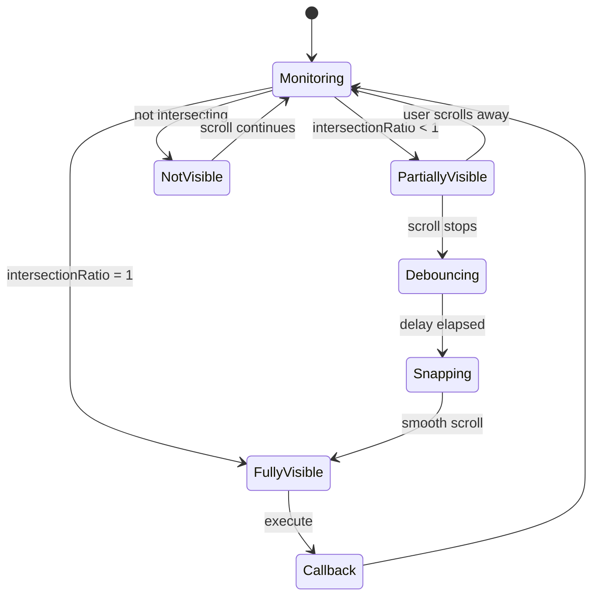

# TriggerSpring

An intelligent scroll behavior controller that automatically snaps scroll positions to fully reveal or hide trigger elements. Uses IntersectionObserver to detect partial visibility and smoothly adjusts scroll position with a spring-like effect.

---

## ✨ Features

- 🎯 **Smart Snap Behavior** — Automatically reveals or hides elements based on visibility
- 🔍 **IntersectionObserver API** — Efficient, native scroll tracking
- ⏱️ **Debounced Spring** — Waits for scroll to settle before snapping
- ↔️ **Directional Control** — Snap left or right edges into view
- 📏 **Offset Support** — Fine-tune snap position with custom offsets
- 🎬 **Smooth Animation** — Uses native smooth scrolling
- 🧹 **Auto Cleanup** — Automatically disconnects observer on page unload
- 🪶 **Lightweight** — Zero dependencies, vanilla JavaScript

---

## 🚀 Quick Start

```javascript
import TriggerSpring from './TriggerSpring/index.js'

const container = document.querySelector('.scroll-container')
const trigger = document.querySelector('.trigger-element')

// Basic usage
new TriggerSpring({
    container: container,
    trigger: trigger,
    callback: () => {
        console.log('Trigger fully visible!')
    }
})

// With options
new TriggerSpring({
    container: container,
    trigger: trigger,
    direction: 'left',     // Snap left edge into view
    offset: 20,            // 20px offset from edge
    delay: 500,            // Wait 500ms after scroll stops
    callback: () => {
        console.log('Trigger revealed!')
    }
})
```

---

## 📖 How It Works

### Snap Behavior

TriggerSpring monitors a trigger element's visibility within its container:

1. **Fully Visible** (100% intersection) → Executes callback, no snap
2. **Partially Visible** (1-99% intersection) → Waits for scroll to stop, then snaps to fully reveal
3. **Not Visible** (0% intersection) → Cancels pending snap
4. **Quick Hide** → If user quickly scrolls away, cancels snap



### Direction Logic

```javascript
// direction: 'left' (default)
// Snaps the LEFT edge of the trigger into view
┌─────────────────────────┐
│ Container               │
│ ┌─────────────────┐    │
│ │ Trigger         │    │  ← Trigger snaps here
│ └─────────────────┘    │
└─────────────────────────┘

// direction: 'right'
// Snaps the RIGHT edge of the trigger into view
┌─────────────────────────┐
│               Container │
│    ┌─────────────────┐ │
│    │         Trigger │ │  ← Trigger snaps here
│    └─────────────────┘ │
└─────────────────────────┘
```

---

## 📚 API Reference

### Constructor

```javascript
new TriggerSpring(options)
```

### Options

| Option | Type | Required | Default | Description |
|--------|------|----------|---------|-------------|
| `container` | `HTMLElement` | Yes | — | Scrollable container element |
| `trigger` | `HTMLElement` | Yes | — | Element to monitor and snap to |
| `callback` | `Function` | Yes | — | Called when trigger is fully visible |
| `direction` | `'left' \| 'right'` | No | `'left'` | Which edge to snap into view |
| `offset` | `number` | No | `0` | Pixel offset from the container edge |
| `delay` | `number` | No | `500` | Debounce delay in ms before snapping |

**Throws:**
- `Error` if `container` is not a valid HTMLElement (when provided)
- `Error` if `trigger` is not a valid HTMLElement
- `Error` if `callback` is not a function
- `Error` if `direction` is not `'left'` or `'right'`
- `Error` if `offset` is not an integer

---

## 🎯 Common Use Cases

### Horizontal Card Carousel

```javascript
const carousel = document.querySelector('.carousel')
const cards = carousel.querySelectorAll('.card')

cards.forEach(card => {
    new TriggerSpring({
        container: carousel,
        trigger: card,
        direction: 'left',
        offset: 20,
        callback: () => {
            card.classList.add('active')
            // Load card content when fully visible
            loadCardContent(card)
        }
    })
})
```

```css
.carousel {
    display: flex;
    overflow-x: auto;
    scroll-snap-type: none; /* Let TriggerSpring handle snapping */
    gap: 1rem;
}

.card {
    flex: 0 0 300px;
    transition: transform 0.3s;
}

.card.active {
    transform: scale(1.05);
}
```

---

### Image Gallery with Previews

```javascript
const gallery = document.querySelector('.gallery-container')
const images = gallery.querySelectorAll('.gallery-image')

images.forEach((img, index) => {
    new TriggerSpring({
        container: gallery,
        trigger: img,
        direction: 'left',
        offset: 0,
        delay: 300,
        callback: () => {
            // Update preview when image fully visible
            updatePreview(index)
            
            // Update URL without reload
            history.replaceState(null, '', `#image-${index}`)
        }
    })
})
```

---

### Timeline Scroller

```javascript
const timeline = document.querySelector('.timeline')
const events = timeline.querySelectorAll('.event')

events.forEach(event => {
    new TriggerSpring({
        container: timeline,
        trigger: event,
        direction: 'left',
        offset: 50,
        delay: 400,
        callback: () => {
            // Highlight event when centered
            events.forEach(e => e.classList.remove('highlighted'))
            event.classList.add('highlighted')
            
            // Show event details
            showEventDetails(event.dataset.eventId)
        }
    })
})
```

---

### Product Showcase

```javascript
const showcase = document.querySelector('.product-showcase')
const products = showcase.querySelectorAll('.product')

products.forEach(product => {
    new TriggerSpring({
        container: showcase,
        trigger: product,
        direction: 'right',
        offset: 100,
        delay: 600,
        callback: () => {
            // Animate product when fully visible
            product.querySelector('.details').classList.add('visible')
            
            // Track view analytics
            trackProductView(product.dataset.productId)
        }
    })
})
```

---

## 🧩 Real-World Example: Story Slider

```javascript
import TriggerSpring from './TriggerSpring/index.js'

class StorySlider {
    constructor(containerId) {
        this.container = document.getElementById(containerId)
        this.stories = this.container.querySelectorAll('.story')
        this.currentIndex = 0
        this.springs = []
        
        this.init()
    }

    init() {
        this.stories.forEach((story, index) => {
            const spring = new TriggerSpring({
                container: this.container,
                trigger: story,
                direction: 'left',
                offset: 0,
                delay: 300,
                callback: () => this.onStoryVisible(story, index)
            })
            
            this.springs.push(spring)
        })

        // Add navigation
        this.addNavigation()
    }

    onStoryVisible(story, index) {
        this.currentIndex = index
        
        // Update active state
        this.stories.forEach(s => s.classList.remove('active'))
        story.classList.add('active')
        
        // Update progress indicators
        this.updateProgress(index)
        
        // Play video if present
        const video = story.querySelector('video')
        if (video) {
            video.play()
        }
        
        // Pause other videos
        this.stories.forEach((s, i) => {
            if (i !== index) {
                const v = s.querySelector('video')
                if (v) v.pause()
            }
        })
    }

    updateProgress(index) {
        const indicators = document.querySelectorAll('.progress-indicator')
        indicators.forEach((indicator, i) => {
            if (i < index) {
                indicator.classList.add('complete')
            } else if (i === index) {
                indicator.classList.add('active')
                indicator.classList.remove('complete')
            } else {
                indicator.classList.remove('active', 'complete')
            }
        })
    }

    addNavigation() {
        const prevBtn = document.querySelector('.prev-story')
        const nextBtn = document.querySelector('.next-story')

        prevBtn?.addEventListener('click', () => this.goToPrevious())
        nextBtn?.addEventListener('click', () => this.goToNext())

        // Keyboard navigation
        document.addEventListener('keydown', (e) => {
            if (e.key === 'ArrowLeft') this.goToPrevious()
            if (e.key === 'ArrowRight') this.goToNext()
        })
    }

    goToNext() {
        if (this.currentIndex < this.stories.length - 1) {
            this.scrollToStory(this.currentIndex + 1)
        }
    }

    goToPrevious() {
        if (this.currentIndex > 0) {
            this.scrollToStory(this.currentIndex - 1)
        }
    }

    scrollToStory(index) {
        const story = this.stories[index]
        const containerRect = this.container.getBoundingClientRect()
        const storyRect = story.getBoundingClientRect()
        const relativeLeft = storyRect.left - containerRect.left + this.container.scrollLeft

        this.container.scrollTo({
            left: relativeLeft,
            behavior: 'smooth'
        })
    }
}

// Usage
const slider = new StorySlider('story-container')
```

```html
<div id="story-container" class="story-slider">
    <div class="story" data-story-id="1">
        <video src="story1.mp4"></video>
    </div>
    <div class="story" data-story-id="2">
        <video src="story2.mp4"></video>
    </div>
    <div class="story" data-story-id="3">
        <video src="story3.mp4"></video>
    </div>
</div>

<div class="progress-bar">
    <div class="progress-indicator"></div>
    <div class="progress-indicator"></div>
    <div class="progress-indicator"></div>
</div>

<button class="prev-story">←</button>
<button class="next-story">→</button>
```

---

## 🧩 Real-World Example: Feature Tour

```javascript
import TriggerSpring from './TriggerSpring/index.js'

class FeatureTour {
    constructor(containerId) {
        this.container = document.getElementById(containerId)
        this.features = this.container.querySelectorAll('.feature')
        this.currentStep = 0
        
        this.init()
    }

    init() {
        this.features.forEach((feature, index) => {
            new TriggerSpring({
                container: this.container,
                trigger: feature,
                direction: 'left',
                offset: 100,
                delay: 400,
                callback: () => this.showFeature(feature, index)
            })
        })
    }

    showFeature(feature, index) {
        this.currentStep = index

        // Fade in feature description
        const description = feature.querySelector('.description')
        description.style.opacity = '1'

        // Update tour counter
        document.querySelector('.tour-counter').textContent = 
            `${index + 1} / ${this.features.length}`

        // Show tooltip
        this.showTooltip(feature)

        // Track tour progress
        this.saveProgress(index)
    }

    showTooltip(feature) {
        const tooltip = feature.querySelector('.tooltip')
        if (tooltip) {
            tooltip.classList.add('visible')
            
            // Auto-hide after 5 seconds
            setTimeout(() => {
                tooltip.classList.remove('visible')
            }, 5000)
        }
    }

    saveProgress(step) {
        localStorage.setItem('tourProgress', JSON.stringify({
            step,
            timestamp: Date.now()
        }))
    }

    restoreProgress() {
        const saved = localStorage.getItem('tourProgress')
        if (saved) {
            const { step } = JSON.parse(saved)
            this.scrollToFeature(step)
        }
    }

    scrollToFeature(index) {
        const feature = this.features[index]
        const containerRect = this.container.getBoundingClientRect()
        const featureRect = feature.getBoundingClientRect()
        const relativeLeft = featureRect.left - containerRect.left + this.container.scrollLeft

        this.container.scrollTo({
            left: relativeLeft - 100,
            behavior: 'smooth'
        })
    }
}

// Usage
const tour = new FeatureTour('feature-tour')
tour.restoreProgress()
```

---

## 💡 Tips & Best Practices

### ✅ Do

```javascript
// Set appropriate delay based on scroll speed
new TriggerSpring({
    container,
    trigger,
    delay: 600,  // ✅ Longer for slower, deliberate scrolls
    callback
})

// Use offset for better visual alignment
new TriggerSpring({
    container,
    trigger,
    offset: 50,  // ✅ Center trigger with padding
    callback
})

// Clean up when removing elements
const spring = new TriggerSpring({ ... })
// Later, when removing:
element.remove()  // Observer auto-disconnects on page unload

// Use direction based on content flow
new TriggerSpring({
    direction: 'left',  // ✅ For left-to-right content
    // or
    direction: 'right',  // ✅ For right-to-left or end-aligned
    ...
})

// Combine with other scroll features
new TriggerSpring({
    container,
    trigger,
    callback: () => {
        trigger.classList.add('active')
        lazyLoadContent(trigger)  // ✅ Load content when visible
        trackView(trigger)        // ✅ Analytics
    }
})
```

### ❌ Avoid

```javascript
// Don't create multiple springs on the same trigger
new TriggerSpring({ trigger: element, ... })
new TriggerSpring({ trigger: element, ... })  // ❌ Conflicts

// Don't use very short delays
new TriggerSpring({
    delay: 50  // ❌ Too short, will snap during scroll
})

// Don't forget error handling in callback
new TriggerSpring({
    callback: () => {
        someFunction()  // ❌ Could throw error
    }
})

// ✅ Better
new TriggerSpring({
    callback: () => {
        try {
            someFunction()
        } catch (err) {
            console.error('Callback error:', err)
        }
    }
})

// Don't use negative offsets without testing
new TriggerSpring({
    offset: -100  // ❌ May cause unexpected behavior
})

// Don't use on non-scrollable containers
const staticDiv = document.querySelector('.no-overflow')
new TriggerSpring({
    container: staticDiv  // ❌ Won't work
})
```

---

## 🎨 Styling Considerations

### CSS Requirements

```css
/* Container must be scrollable */
.scroll-container {
    overflow-x: auto;
    display: flex;
    gap: 1rem;
}

/* Triggers should be sizeable */
.trigger {
    flex: 0 0 300px;
    min-width: 300px;
}

/* Optional: Disable default scroll snap */
.scroll-container {
    scroll-snap-type: none;  /* Let TriggerSpring handle it */
}

/* Style active triggers */
.trigger.active {
    transform: scale(1.05);
    z-index: 10;
    box-shadow: 0 4px 12px rgba(0,0,0,0.15);
}
```

### Animation Recommendations

```css
/* Smooth transitions for active state */
.trigger {
    transition: transform 0.3s ease, box-shadow 0.3s ease;
}

/* Optional: Add indicator for snapping */
.trigger::before {
    content: '';
    position: absolute;
    left: 0;
    top: 0;
    height: 100%;
    width: 3px;
    background: var(--accent-color);
    opacity: 0;
    transition: opacity 0.3s;
}

.trigger.active::before {
    opacity: 1;
}
```

---

## ⚙️ Advanced Configuration

### Customizing Snap Behavior

```javascript
// Quick snap for small containers
new TriggerSpring({
    container,
    trigger,
    delay: 200,      // Snap quickly
    offset: 0,       // Exact edge alignment
    callback
})

// Gentle snap for large content
new TriggerSpring({
    container,
    trigger,
    delay: 800,      // Wait longer
    offset: 100,     // Generous padding
    callback
})
```

### Multiple Triggers with Shared Callback

```javascript
const triggers = document.querySelectorAll('.slide')
let currentSlide = 0

triggers.forEach((trigger, index) => {
    new TriggerSpring({
        container: slideContainer,
        trigger,
        direction: 'left',
        callback: () => {
            currentSlide = index
            updateSlideIndicator(index)
        }
    })
})

function updateSlideIndicator(index) {
    document.querySelectorAll('.indicator').forEach((ind, i) => {
        ind.classList.toggle('active', i === index)
    })
}
```

### Conditional Snapping

```javascript
let enableSnapping = true

new TriggerSpring({
    container,
    trigger,
    callback: () => {
        if (enableSnapping) {
            // Execute normal behavior
            console.log('Snapped!')
        }
    }
})

// Disable snapping during certain interactions
dragHandler.on('start', () => { enableSnapping = false })
dragHandler.on('end', () => { enableSnapping = true })
```

---

## 🔍 Technical Details

### IntersectionObserver Configuration

TriggerSpring uses these IntersectionObserver settings:

```javascript
{
    root: container,                    // Observe within container
    rootMargin: `${offset}px`,          // Adjust intersection area
    threshold: [0, 0.05, 0.25, 0.5, 0.75, 1.0]  // Track visibility steps
}
```

### Intersection States

| intersectionRatio | State | Action |
|------------------|-------|--------|
| `0` | Not visible | Cancel pending snap |
| `0.01 - 0.99` | Partially visible | Start debounce timer |
| `1.0` | Fully visible | Execute callback, cancel snap |

### Scroll Position Calculation

```javascript
// For direction: 'left'
const containerRect = container.getBoundingClientRect()
const targetRect = trigger.getBoundingClientRect()
const relativeLeft = targetRect.left - containerRect.left + container.scrollLeft
const targetScrollLeft = relativeLeft + offset

// For direction: 'right'
const containerWidth = container.clientWidth
const targetWidth = trigger.offsetWidth
const targetScrollLeft = relativeLeft - containerWidth + targetWidth + offset
```

### Debounce Implementation

The spring effect uses a custom debounce that can be cancelled:

```javascript
function debounce(func, delay) {
    let timeoutId
    
    const debouncedFn = function(...args) {
        clearTimeout(timeoutId)
        timeoutId = setTimeout(() => func.apply(this, args), delay)
    }
    
    debouncedFn.cancel = function() {
        clearTimeout(timeoutId)
        timeoutId = null
    }
    
    return debouncedFn
}
```

---

## 🐛 Troubleshooting

### Snap not triggering

**Check:** Container is scrollable and trigger is child element

```css
.container {
    overflow-x: auto;  /* Required */
    display: flex;     /* Or similar layout */
}
```

### Snap happens too quickly/slowly

**Solution:** Adjust delay parameter

```javascript
new TriggerSpring({
    delay: 800  // Increase for slower response
})
```

### Callback fires multiple times

**Check:** Make sure callback is idempotent

```javascript
let processed = false

new TriggerSpring({
    callback: () => {
        if (processed) return
        processed = true
        
        // Your code here
        
        setTimeout(() => { processed = false }, 1000)
    }
})
```

### Wrong snap direction

**Solution:** Verify direction matches your layout

```javascript
// For left-to-right content
direction: 'left'   // Snaps left edge into view

// For right-to-left content
direction: 'right'  // Snaps right edge into view
```

### Offset not working as expected

**Check:** Offset is an integer and consider container padding

```javascript
new TriggerSpring({
    offset: 50,  // Must be integer, not '50px'
    // Consider container's own padding in calculation
})
```

### Performance issues with many triggers

**Solution:** Limit number of active TriggerSpring instances

```javascript
// Instead of creating for all elements
triggers.forEach(t => new TriggerSpring({ trigger: t, ... }))

// Create only for visible + adjacent elements
const visibleTriggers = getVisibleAndAdjacentTriggers()
visibleTriggers.forEach(t => new TriggerSpring({ trigger: t, ... }))
```