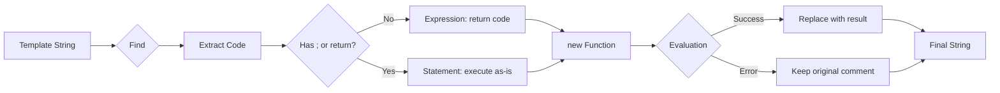

# replacer

A lightweight template engine that evaluates JavaScript expressions and statements embedded in HTML comments. Transform dynamic templates by replacing `<!--code-->` placeholders with their evaluated results.

---

## ✨ Features

- 🎯 **Simple Syntax** — Use familiar HTML comments for placeholders
- 🔢 **Expression Evaluation** — Evaluate JavaScript expressions directly
- 📝 **Statement Execution** — Run multi-line JavaScript code blocks
- 🛡️ **Safe Fallback** — Preserves original comments on evaluation errors
- 🔒 **Scoped Variables** — Controlled variable access via data object
- 🪶 **Lightweight** — Minimal code, zero dependencies
- ⚡ **Fast** — Uses efficient regex replacement

---

## 🚀 Quick Start

```javascript
import { replacer } from './replacer/index.js'

// Simple variable replacement
const template = '<div>Hello, <!--name-->!</div>'
const data = { name: 'Alice' }
replacer(template, data)
// Result: '<div>Hello, Alice!</div>'

// Expression evaluation
const template2 = '<span>Price: $<!--price * 1.2--></span>'
const data2 = { price: 100 }
replacer(template2, data2)
// Result: '<span>Price: $120</span>'

// Statement execution
const template3 = '<p><!--const total = a + b; return total;--></p>'
const data3 = { a: 10, b: 20 }
replacer(template3, data3)
// Result: '<p>30</p>'
```

---

## 📖 How It Works

The function processes templates in three steps:

1. **Find Placeholders** — Regex matches all `<!--...-->` comments
2. **Determine Type** — Detects if code is an expression or statement
3. **Evaluate & Replace** — Executes code and replaces comment with result



### Expression vs Statement Detection

```javascript
// EXPRESSIONS (no semicolons, no return keyword)
<!--name-->                    → return (name);
<!--age + 5-->                 → return (age + 5);
<!--items.length > 0-->        → return (items.length > 0);

// STATEMENTS (has semicolons or return keyword)
<!--const x = a + b; return x;-->          → Executed as-is
<!--if (age > 18) return 'Adult';-->       → Executed as-is
<!--return items.map(i => i.name);-->      → Executed as-is
```

---

## 📚 API Reference

### `replacer(template, data)`

Replaces HTML comment placeholders with evaluated JavaScript results.

| Parameter | Type | Description |
|-----------|------|-------------|
| `template` | `string` | Template string containing `<!--code-->` placeholders |
| `data` | `Object` | Variables accessible to the evaluated code |

**Returns:** `string` — Template with placeholders replaced by evaluation results

**Behavior:**
- Successfully evaluated code is replaced with its result
- `undefined` results preserve the original comment
- Evaluation errors log a warning and preserve the original comment
- Comments without code are preserved as-is

```javascript
replacer('<!--x + y-->', { x: 5, y: 3 })           // "8"
replacer('<!--name-->', { name: 'Bob' })           // "Bob"
replacer('<!--invalid.prop-->', {})                // "<!--invalid.prop-->" (error)
replacer('<!--return undefined;-->', {})           // "<!--return undefined;-->" (undefined result)
```

---

## 🎯 Common Use Cases

### Dynamic HTML Generation

```javascript
import { replacer } from './replacer/index.js'

const userCard = `
    <div class="user-card">
        <h2><!--name--></h2>
        <p>Age: <!--age--></p>
        <p>Status: <!--status === 'active' ? 'Active' : 'Inactive'--></p>
    </div>
`

const userData = {
    name: 'Alice Johnson',
    age: 28,
    status: 'active'
}

const html = replacer(userCard, userData)
```

---

### Conditional Rendering

```javascript
const template = `
    <div>
        <!--isLoggedIn ? 'Welcome back!' : 'Please log in'-->
    </div>
    <nav>
        <!--isAdmin ? '<a href="/admin">Admin Panel</a>' : ''-->
    </nav>
`

const context = {
    isLoggedIn: true,
    isAdmin: false
}

const html = replacer(template, context)
// Result: <div>Welcome back!</div><nav></nav>
```

---

### List Rendering

```javascript
const listTemplate = `
    <ul>
        <!--items.map(item => '<li>' + item.name + '</li>').join('')-->
    </ul>
`

const listData = {
    items: [
        { name: 'Apple' },
        { name: 'Banana' },
        { name: 'Orange' }
    ]
}

const html = replacer(listTemplate, listData)
// Result: <ul><li>Apple</li><li>Banana</li><li>Orange</li></ul>
```

---

### Complex Logic

```javascript
const template = `
    <div class="product">
        <h3><!--product.name--></h3>
        <p class="price">
            <!--
                const discount = product.onSale ? 0.2 : 0;
                const finalPrice = product.price * (1 - discount);
                return '$' + finalPrice.toFixed(2);
            -->
        </p>
        <span class="badge">
            <!--
                if (product.stock === 0) return 'Out of Stock';
                if (product.stock < 5) return 'Low Stock';
                return 'In Stock';
            -->
        </span>
    </div>
`

const productData = {
    product: {
        name: 'Wireless Mouse',
        price: 29.99,
        onSale: true,
        stock: 3
    }
}

const html = replacer(template, productData)
```

---

## 🧩 Real-World Example: Email Template Engine

```javascript
import { replacer } from './replacer/index.js'

class EmailTemplate {
    constructor(template) {
        this.template = template
    }

    render(data) {
        return replacer(this.template, data)
    }

    static welcome(data) {
        const template = `
            <!DOCTYPE html>
            <html>
            <head>
                <title>Welcome to <!--companyName--></title>
            </head>
            <body>
                <h1>Welcome, <!--user.firstName-->!</h1>
                <p>Thank you for joining <!--companyName-->.</p>
                
                <!--
                    if (user.referralCode) {
                        return '<p>Your referral code: <strong>' + user.referralCode + '</strong></p>';
                    }
                    return '';
                -->
                
                <p>
                    Your account has been created with the email: 
                    <strong><!--user.email--></strong>
                </p>
                
                <div class="features">
                    <!--
                        const features = [
                            'Access to premium content',
                            'Priority support',
                            '30-day money-back guarantee'
                        ];
                        return features.map(f => '<li>' + f + '</li>').join('');
                    -->
                </div>
                
                <a href="<!--baseUrl-->/verify?token=<!--verificationToken-->">
                    Verify Your Email
                </a>
            </body>
            </html>
        `
        
        return new EmailTemplate(template).render(data)
    }

    static orderConfirmation(data) {
        const template = `
            <div class="order-confirmation">
                <h2>Order #<!--order.id--></h2>
                <p>Thank you for your purchase, <!--customer.name-->!</p>
                
                <table>
                    <thead>
                        <tr><th>Item</th><th>Qty</th><th>Price</th></tr>
                    </thead>
                    <tbody>
                        <!--
                            return order.items.map(item => 
                                '<tr>' +
                                '<td>' + item.name + '</td>' +
                                '<td>' + item.quantity + '</td>' +
                                '<td>$' + (item.price * item.quantity).toFixed(2) + '</td>' +
                                '</tr>'
                            ).join('');
                        -->
                    </tbody>
                </table>
                
                <p class="total">
                    Total: $<!--order.items.reduce((sum, i) => sum + (i.price * i.quantity), 0).toFixed(2)-->
                </p>
            </div>
        `
        
        return new EmailTemplate(template).render(data)
    }
}

// Usage
const welcomeEmail = EmailTemplate.welcome({
    companyName: 'TechCorp',
    baseUrl: 'https://example.com',
    verificationToken: 'abc123xyz',
    user: {
        firstName: 'John',
        email: 'john@example.com',
        referralCode: 'JOHN2024'
    }
})

const orderEmail = EmailTemplate.orderConfirmation({
    customer: { name: 'Jane Doe' },
    order: {
        id: '12345',
        items: [
            { name: 'Laptop', quantity: 1, price: 999.99 },
            { name: 'Mouse', quantity: 2, price: 29.99 }
        ]
    }
})
```

---

## 🧩 Real-World Example: Component Template System

```javascript
import { replacer } from './replacer/index.js'

class Component {
    constructor(template) {
        this.template = template
        this.state = {}
    }

    setState(newState) {
        this.state = { ...this.state, ...newState }
        this.render()
    }

    render() {
        const html = replacer(this.template, this.state)
        if (this.element) {
            this.element.innerHTML = html
        }
        return html
    }

    mount(selector) {
        this.element = document.querySelector(selector)
        this.render()
    }
}

// Usage
const counterTemplate = `
    <div class="counter">
        <h2>Counter: <!--count--></h2>
        <p>Status: <!--count > 10 ? 'High' : 'Normal'--></p>
        <button onclick="app.increment()">+</button>
        <button onclick="app.decrement()">-</button>
        <button onclick="app.reset()">Reset</button>
    </div>
`

class CounterApp extends Component {
    constructor() {
        super(counterTemplate)
        this.setState({ count: 0 })
    }

    increment() {
        this.setState({ count: this.state.count + 1 })
    }

    decrement() {
        this.setState({ count: this.state.count - 1 })
    }

    reset() {
        this.setState({ count: 0 })
    }
}

const app = new CounterApp()
app.mount('#app')
```

---

## 🧩 Real-World Example: Configuration-Based Templates

```javascript
import { replacer } from './replacer/index.js'

class DashboardBuilder {
    constructor(config) {
        this.config = config
    }

    build() {
        const template = `
            <div class="dashboard">
                <header>
                    <h1><!--config.title--></h1>
                    <!--config.subtitle ? '<p>' + config.subtitle + '</p>' : ''-->
                </header>
                
                <div class="widgets">
                    <!--
                        return config.widgets.map(widget => {
                            const widgetTemplate = '<div class="widget ' + widget.type + '">' +
                                '<h3>' + widget.title + '</h3>' +
                                '<div class="content">' + widget.content + '</div>' +
                                '</div>';
                            return widgetTemplate;
                        }).join('');
                    -->
                </div>
                
                <!--
                    if (config.showFooter) {
                        return '<footer>' +
                            '<p>Last updated: ' + new Date().toLocaleString() + '</p>' +
                            '</footer>';
                    }
                    return '';
                -->
            </div>
        `

        return replacer(template, { config: this.config })
    }
}

// Usage
const dashboard = new DashboardBuilder({
    title: 'Analytics Dashboard',
    subtitle: 'Real-time metrics',
    showFooter: true,
    widgets: [
        {
            type: 'metric',
            title: 'Total Users',
            content: '15,234'
        },
        {
            type: 'chart',
            title: 'Revenue',
            content: '<canvas id="revenue-chart"></canvas>'
        },
        {
            type: 'alert',
            title: 'Notifications',
            content: 'You have 3 new alerts'
        }
    ]
})

const html = dashboard.build()
```

---

## 💡 Tips & Best Practices

### ✅ Do

```javascript
// Use expressions for simple values
replacer('<!--name-->', { name: 'Alice' })

// Use statements for complex logic
const template = `
    <!--
        const total = items.reduce((sum, item) => sum + item.price, 0);
        return '$' + total.toFixed(2);
    -->
`

// Return strings for HTML content
<!--items.map(i => '<li>' + i + '</li>').join('')-->

// Check for undefined/null before accessing properties
<!--user && user.name ? user.name : 'Guest'-->

// Use ternary operators for conditionals
<!--isActive ? 'Active' : 'Inactive'-->

// Format numbers appropriately
<!--price.toFixed(2)-->

// Provide fallback values
<!--title || 'Untitled'-->
```

### ❌ Avoid

```javascript
// Don't use expressions that modify state
<!--items.push(newItem)-->  // ❌ Side effects

// Don't rely on external closures
let external = 10
replacer('<!--external + 5-->', {})  // ❌ Won't work

// Don't use DOM manipulation
<!--document.getElementById('x')-->  // ❌ No DOM access

// Don't forget to escape HTML in user content
<!--userInput-->  // ❌ Potential XSS if userInput contains HTML

// Don't use async operations
<!--await fetch('/api')-->  // ❌ Async not supported

// Don't use very complex logic in expressions
<!--really.long.complex.expression.that.should.be.a.function()-->  // ❌ Hard to read
```

---

## 🔒 Security Considerations

### XSS Prevention

The `replacer` function **does not escape HTML** by default. Always sanitize user input:

```javascript
// ❌ DANGEROUS - XSS vulnerability
const userInput = '<script>alert("XSS")</script>'
replacer('<!--content-->', { content: userInput })
// Result: <script>alert("XSS")</script>

// ✅ SAFE - Escape HTML
function escapeHtml(text) {
    const map = {
        '&': '&amp;',
        '<': '&lt;',
        '>': '&gt;',
        '"': '&quot;',
        "'": '&#039;'
    }
    return text.replace(/[&<>"']/g, m => map[m])
}

const safeContent = escapeHtml(userInput)
replacer('<!--content-->', { content: safeContent })
// Result: &lt;script&gt;alert("XSS")&lt;/script&gt;
```

### Trusted Content Only

Only use `replacer` with **trusted templates and data**:

```javascript
// ✅ SAFE - Controlled template and data
const template = '<div><!--name--></div>'
const data = { name: sanitizedUserName }

// ❌ DANGEROUS - User-controlled template
const userTemplate = getUserTemplate()  // Could contain malicious code
replacer(userTemplate, data)
```

### Code Injection

Be aware that all data values are accessible in the evaluated code:

```javascript
// User provides: { name: 'Alice', admin: true }
// Template: <!--admin ? 'Admin Panel' : 'User Panel'-->
// User can see/manipulate the admin flag through the template
```

---

## 🔍 Technical Details

### Function Generation

The replacer creates a new function for each placeholder:

```javascript
// For expression: <!--x + y-->
new Function('x', 'y', 'return (x + y);')(5, 3)

// For statement: <!--const z = x + y; return z;-->
new Function('x', 'y', '"use strict";\nconst z = x + y; return z;')(5, 3)
```

### Regex Pattern

```javascript
/<!--(.*?)-->/gs
```

- `<!--` — Literal start of HTML comment
- `(.*?)` — Non-greedy capture of content
- `-->` — Literal end of HTML comment
- `g` flag — Global (all matches)
- `s` flag — Dot matches newlines (for multi-line code)

### Strict Mode

Statements are evaluated in strict mode:

```javascript
"use strict";\n${code}
```

This prevents common mistakes like:
- Undeclared variables
- Duplicate parameters
- Invalid octal syntax
- Assignment to read-only properties

---

## 🐛 Troubleshooting

### Comment not replaced

**Check:** Variable exists in data object

```javascript
replacer('<!--name-->', {})  // Returns: <!--name--> (undefined)
replacer('<!--name-->', { name: 'Alice' })  // Returns: Alice ✅
```

### Expression returns undefined

**Check:** Expression evaluates to undefined

```javascript
replacer('<!--items.find(i => i.id === 999)-->', { items: [] })
// Returns: <!--items.find(i => i.id === 999)-->
```

**Solution:** Provide fallback

```javascript
<!--items.find(i => i.id === 999) || 'Not found'-->
```

### Syntax errors in evaluation

**Check:** Console for warnings

```javascript
replacer('<!--invalid syntax!-->', {})
// Console: "Error evaluating expression: <!--invalid syntax!-->"
// Returns: <!--invalid syntax!-->
```

### Multi-line code not working

**Check:** Use proper statement syntax

```javascript
// ❌ Won't work (expression with semicolons)
<!--
const x = 5;
const y = 10;
x + y
-->

// ✅ Works (explicit return)
<!--
const x = 5;
const y = 10;
return x + y;
-->
```

### HTML not rendering

**Check:** Return string, not object

```javascript
// ❌ Returns [object Object]
<!--{ tag: 'div', text: 'Hello' }-->

// ✅ Returns HTML string
<!--'<div>Hello</div>'-->
```